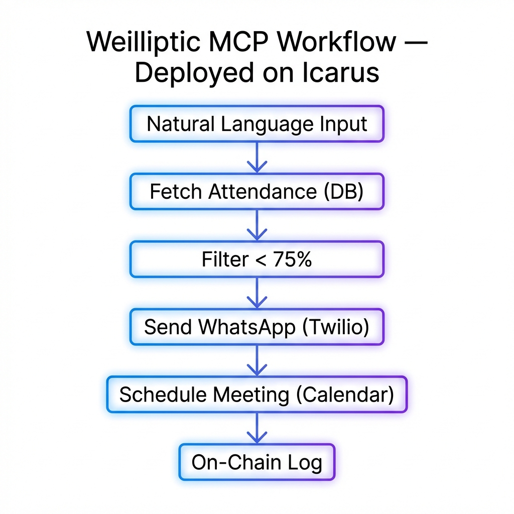

# Smart Autonomous University Agent

## Overview
This project acts as a smart autonomous agent for university management, handling attendance monitoring, student notifications, and blockchain logging.

## Weilliptic & Icarus Integration

This project defines academic workflows as Model Context Protocol (MCP)
steps using Weilliptic’s agentic workflow model.

The LowAttendanceWorkflow is deployed on Icarus, where:
- Each step is visualized
- Execution order is tracked
- Failures and retries are observable
- On-chain audit logs are linked per execution

Workflow steps:
1. Fetch attendance from Supabase
2. Filter students based on policy thresholds
3. Send WhatsApp notifications via Twilio
4. Schedule escalation meetings via Calendar
5. Emit on-chain audit events
